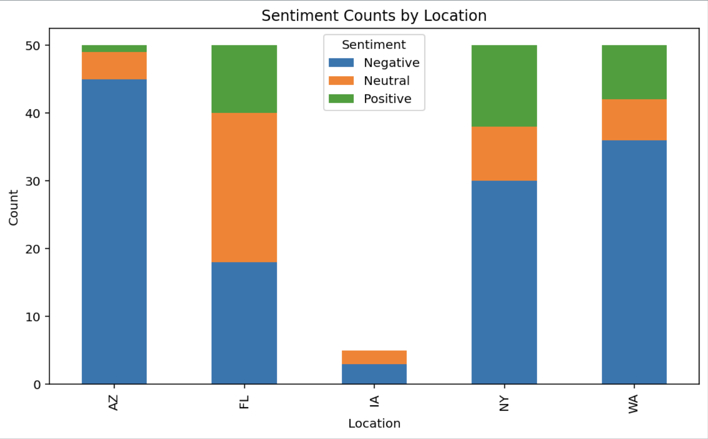

<!-- TwitterSentiment README (HTML) -->

<h1>TwitterSentiment</h1> 

<strong>Pipeline for pulling and performing sentiment analysis of Tweets on a specific subject</strong>

<h2>TLDR</h2>

  <strong>TwitterSentiment</strong> is a reproducible data pipeline to pull tweets on a specific subject, preprocess and clean
  text for use, perform VADER sentiment analysis, and visualize results. As a test case, we applied this to compare sentiment of 
  a sample of recent climate-change-related tweets across multiple states. This can be upscaled to a larger number of tweets
  and any topic of choice. To deal

<h2>Highlights</h2>
<ul>
  <li><strong>API Usage</strong>: access and pulled data from Twitter API</li>
  <li><strong>Text Data</strong>: organizing, cleaning, and preprocessing text data for analysis</strong></li>
  <li><strong>Object-Oriented Programming</strong>: class object for reproducible sentiment analysis</li>
  <li><strong>Sentiment Analysis</strong>: trends in environmental drivers across seasons, climates, and ecosystems</li>
  <li><strong>GitHub and Collaboration</strong>: group project maintained through GitHub</li>
</ul>

<h2>Skills</h2>
<ul>
  <li><strong>Languages</strong>: Python</li>
  <li><strong>Libraries</strong>: Pandas, VADER, matplotlib</li>
  <li><strong>Compute</strong>: API usage, object-oriented programming</li>
  <li><strong>Data Source</strong>: <a href="https://ameriflux.lbl.gov](https://docs.x.com/x-api/introduction">X API</a></li>
</ul>

<h2>Test Case 1: Climate Change Analysis</h2>

  As a test case, we used the TwitterSentiment pipeline to extract and analyze sentiment towards climate change on
  Twitter across various locations in the United States. From this, we were able to identify regional trends. For 
  example, of the locations observed, Arizona had the most negative tweets regarding climate change, while Florida
  had the most neutral sentiment and New York the most positive.
  

<h2>Workflow Overview</h2>
<pre>
carbonflux/
├── X_webscrape.py          # Pipeline to pull subject data from Twitter API
├── load_data.py            # Function to load Tweet pickle and preprocess
├── sentimentAnalysis.py    # Class to perform sentiment analysis
├── test_case1.py           # Climate change test case
├── test_case1_visual.py    # Visualization for test case 1
└── README.md
</pre>

<h2>Future Directions</h2>
<ul>
  <li><strong>Upscaling</strong>: This pipeline is prepared for a larger number of tweets, we just need API access.</li>
  <li><strong>Location Boundaries</strong>: Paid API access would also allow us to expand the analysis to include 
                                            location boundaries. This would prevent some locations (eg Iowa) from not
                                            having enough subject-related tweets. </li>
</ul>

<h2>Contact</h2>

  For questions or collaboration: <strong>marleeyork2025@gmail.com</strong> 

  
